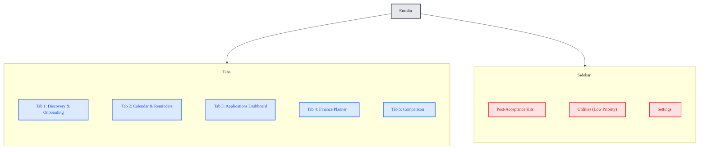
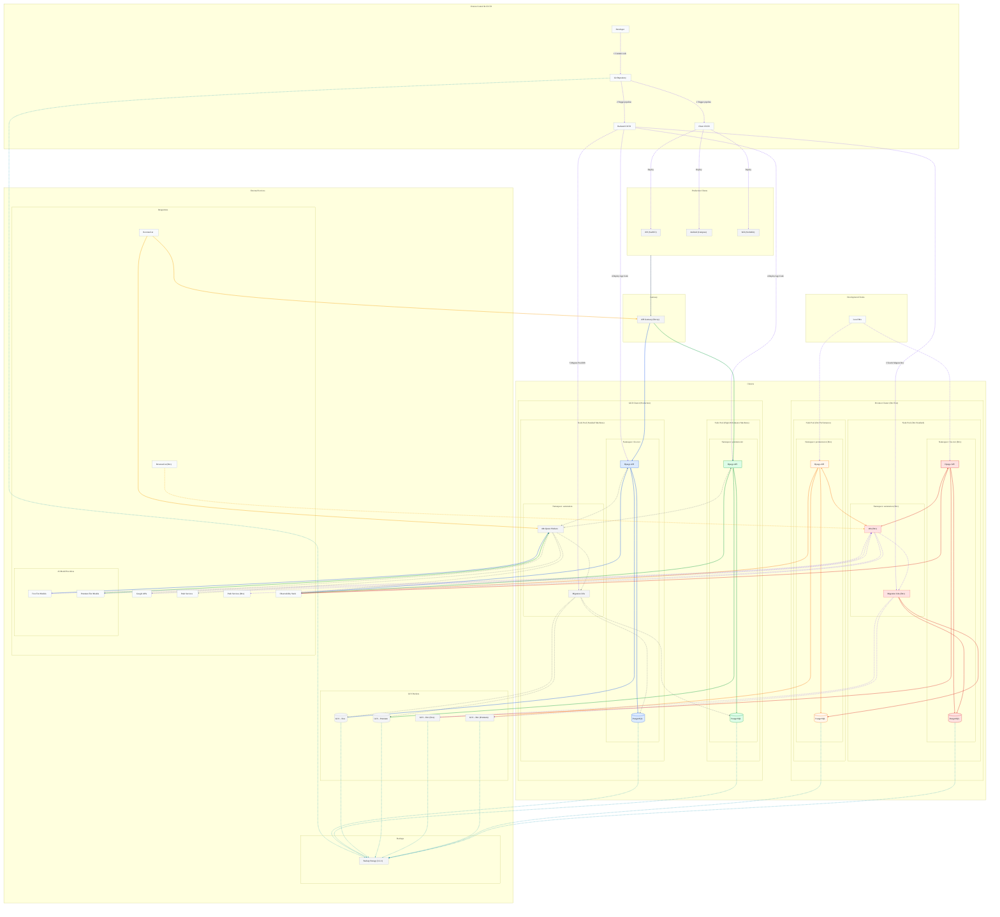

# Enrolia

Enrolia is a post-graduate application workflow that pulls admission data, deadlines, scholarships, faculty rosters, peer groups, reddit threads and VISA information into one live hub for students. 

## Product Flow and UI (5 tabs and sidebar)

### Tab 1 · Discovery & Onboarding
- Three fields: University, program, intake duration, Optional field(add spouse/family)
- Results shows (5-7 minutes): (applicants' country specific)
  - Deadlines
  - Tuition and insurance fees
  - Scholarships available
  - Relevant Faculty list with email and research areas
  - Current students in the program with linked-in profiles
  - Cost of living around the University Area
  - Visa processing times (if applicable)
  - Reddit threads related to the program
  - Local recent news relevant for the candidate (frequent storms, tsunami prone, theft prone, anti-immigrant riots etc.)
  - Working laws for full/part time students
  - Recent graduates from the university (< 2 years) and what they are doing
  - Optional (laws regarding family immigration, and extra funding from university for family support)
- Call to action: <strong>Add to Dashboard</strong>

### Tab 2 · Calender and Reminders
- Calendar view with color-coded event types (application, scholarship, SOP, LOR, interview)
- One-click sync to Google Calendar
- Early reminders via mail and notifications to user to fill their SOPs, get LORs, pay application fees way before time (reminders can be edited)
- Basic application and scholarship deadlines are added when clicked on CTA in tab1

### Tab 3 · Applications Dashboard (Center Tab)
- Grid/list of programs with status progression `Not Started → Drafting → Submitted → Accepted/Rejected`
- Expanding panel provides:
  - Checklists (required documents, GRE/IELTS, custom tasks) and percent completion
  - Essay studio: embedded google docs that is deep linked (open the google docs app if available or an embedded web view)
  - Drive linked documents
  - Sharing link of SOPs for people to review (and add suggestions)
  - Option to delete application
- Basic checklist already added when clicked on CTA in tab1

### Tab 4 · Finance Planner
- Tuition, insurance and living cost(prefilled) with scholarship offsets (can change the different amounts)
- Loan planner which allows user to add various funding sources (family savings, part-time work, internships during vacations, professors' grants), with EMI slider
- Not planning anything like this right now (but there is always an option to recommend local banks and insurance)
- Option to export this info as pdf

### Tab 5 · Comparison 
- Side-by-side cards (up to 3 programs) with fees, location, ranking, research opportunities, visa timelines, funding options, basically all the info we scraped earlier for choosing and deciding their options via a scoring system where the candidate can select how much weight they want to put towards each criteria. (there would be a default weight applied)

### Sidebar · Post-Acceptance Kits
- Visa checklist per destination, pre-departure packing, packing checklist, arrival paperwork (I have expertise in making overkill packing checklists!!!)
- Also gives user a document for common laws that he/she could be unaware coming from a different country
- When user updates that they accepted an offer, a checklist for that university is generated for them. 
- Option to export to pdf

### Sidebar · Utilities (Low priority)
- Very straight to the point, pdf resizer/size reducer and jpeg size reducer/resizer - Low priority 
- Gmail monitoring for university and professor replies (from official domains) - default opt out (but user can opt in for this) - Low priority feature
- Chrome extension for prefilling profile info during applications (higher priority)
- Daily (pre curated) ling of one thread/blog posts/video about story of a student getting into the program of their choice (higher priority)
- Additional language support (lower priority)
- Screen reader support (higher priority)

### Sidebar · Settings
- Profile & Identity: Name, photo, nationality, education level, GRE/GMAT scores, GPA scale, research interests (for prefilling in applications)
- Data & Privacy: GPDR compliancy, option to request deletion of data from server during account deletion, revoking drive/gmail/google account access (can't use most features without it)
- Delete account
- Subscriptions (not planned the cost model yet)
- Feature requests/ feedback section

## Planned Architecture and development flow

## Current progress
- Researched and designed the UI flow, have started creating some mocks in figma
- Researched about the backend architecture, current plan is to have one development environment in my homelab and two production server on GKE (one for free, one for premium servers). During the alpha would not be going for HA and would be just following 3-2-1 backups. 
- Have started developing 2 of the n8n workflows, only testing with local models right now (whatever currently my llama.cpp server can handle on 24gb VRAM)
- After workflow finalization, I am tilting towards groq (if the open-weights models work as expected)
- The plan is to use the lowest possible performant model as slave to get the workflow to appropriate results, for the master model, I am testing with GPT OSS ones, but would go for models GPT 5 medium reasoning one when I have finalised. 

## Plan
- Prototype: I plan to have a alpha version of Enrolia by December 15th. I would have ample time in December to solve user queries after invite only release. I won't have any premium tier during alpha release.  

- During alpha phase, would only be marketing through reddit threads, linked-in and personal circle (no ads yet)

- Alpha (Dec 2025): I am not going to charge users during the alpha stage so would be bleeding a little in API costs and server costs duing this phase. I ran a small experiment in my homelab (4 node PVE cluser with my own networking), a kubernetes cluster similar to my experiment would cost me around 100 dollar per month for hardware and 400-600 dollars in API for 4000-5000 users. (Assuming users are not abusing the app, I would be rate limitng for that)
I would also be limiting my alpha release to 10000 users so that I can contain the initial costs. 

- Pricing/Subscription cost: I am not deciding the subscription cost right now and also brainstorming if I should have a one time BYOK option. I would have much clarity about my expense v/s pricing strategy during the alpha release. 

- Beta target: Beta stage should be around March-April, however I want to polish the UX and onboarding before that and will extend that if not ready to my expectations. Will think about ads and marketing strategies. 

- Developer tools: Jira and mattermost is my goto, however I am inclining towards using linear too (haven't decided that yet)

## Grant usage

- Primarily would be using the grant for API credits and GCP costs (after extinguishing the free GCP credits)

## Future plan

- Will be applying for GCP start tier credits after Jan. 
- Depending upon the initial respone during alpha phase, will think about scaling the infra and marketing strategies

